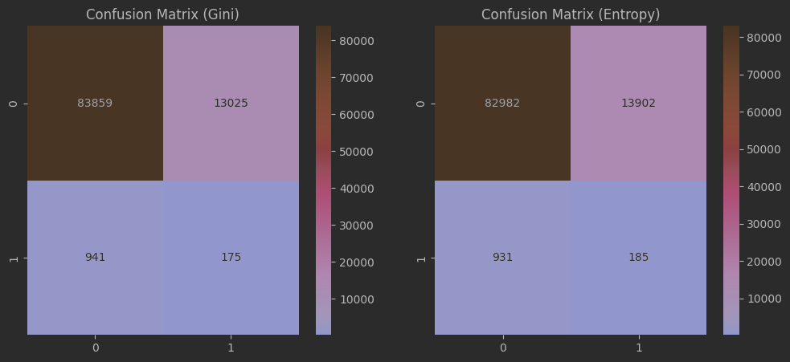
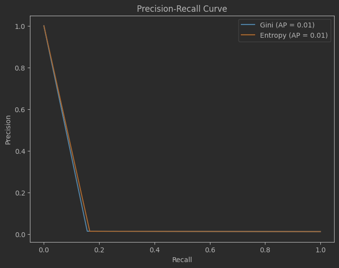
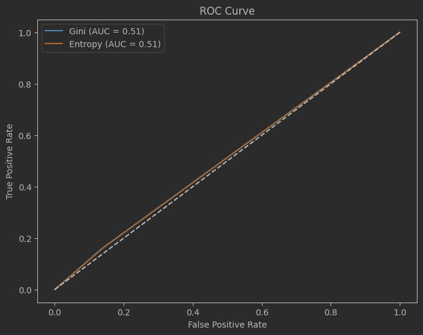

# Fraud Detection with Decision Trees

## Introduction

Welcome to our fraud detection project repository! In this project, we delve into the challenge of identifying fraudulent transactions using a Decision Tree Classifier. Our aim is to leverage the power of decision trees to sift through transactional data, distinguishing between legitimate and fraudulent activities. This repository contains the code, datasets, and documentation outlining our approach to build a robust model capable of making accurate predictions.

## Project Overview

Fraudulent transactions pose a significant threat to the integrity of financial systems, affecting businesses and consumers alike. Detecting such activities promptly and accurately is crucial for mitigating risks and minimizing losses. In this project, we focus on utilizing Decision Tree algorithms—a popular and effective machine learning technique known for its simplicity, interpretability, and efficiency in handling complex datasets.

The repository is structured to guide you through the entire process of developing the Decision Tree model, from initial data exploration to model evaluation and tuning. Here's what you can expect to find:

- **Data Exploration**: An initial look into the dataset to understand its structure, identify patterns, and spot any inconsistencies or anomalies.
- **Preprocessing and Feature Engineering**: Steps to prepare the data for modeling, including cleaning, normalization, and feature selection, to enhance model performance.
- **Model Training**: Code and documentation for training the Decision Tree Classifier, exploring both the Gini index and Entropy methods to find the optimal approach for our fraud detection goals.
- **Evaluation and Tuning**: A detailed analysis of the model's performance using various metrics, such as accuracy, precision, recall, and the F1 score, along with techniques to fine-tune and improve the model.
- **Insights and Conclusions**: Key takeaways from the project, including the model's strengths, limitations, and potential areas for further exploration.

## Purpose

The primary purpose of this repository is to provide a comprehensive and accessible resource for anyone interested in applying Decision Tree algorithms for fraud detection. Whether you're a data science enthusiast, a student, or a professional in the field, you'll find valuable insights and practical code examples to help you understand and implement fraud detection models.

## Data Preprocessing and Cleaning Overview

In this comprehensive preprocessing and cleaning phase of the project, the dataset undergoes several crucial transformations aimed at enhancing its quality and preparing it for effective analysis and modeling. These transformations are critical for addressing common issues in financial datasets, such as improperly recorded values, and for tailoring the data to better suit the algorithms intended for subsequent analyses. The procedures can be categorized into distinct segments, each with specific goals and outcomes.

### Replacing Zero Values

**Tag**: Data Imputation

In this segment, specific continuous features are targeted for the replacement of zero values, based on predefined rules that consider the transaction type. Zero values, which may inaccurately represent the lack of activity or presence of transactions, are replaced with the mean value of the respective feature for non-zero instances of the same transaction type. This approach mitigates the skewing effect of zeros, ensuring a more accurate representation of transaction behaviors and amounts, which is essential for preventing model bias towards non-representative zero values.

### One-Hot Encoding for Transaction Types

**Tag**: Feature Encoding

To accommodate the categorical nature of the `type` column, which denotes the transaction type, one-hot encoding is applied. This process converts the categorical transaction types into a series of binary columns, one for each category, thereby enabling the model to effectively incorporate the transaction type as a part of its analysis. This encoding method enhances model interpretability and avoids the ordinal implications that come with label encoding for nominal data.

### Label Encoding for Identifiers

**Tag**: Feature Transformation

Identifiers for transaction origins and destinations, represented by `nameOrig` and `nameDest`, are transformed using label encoding. This conversion assigns a unique integer to each unique identifier, simplifying the dataset while preserving the ability to distinguish between different entities. This step is particularly beneficial for models that cannot directly process string values but can derive patterns from numerical identifiers, facilitating analyses that consider the transaction flow between entities.

### Discretizing Continuous Values

**Tag**: Feature Discretization

Continuous features are discretized through clustering, specifically using the K-Means algorithm to group data points into a predefined number of clusters based on their value. Each instance is then labeled with its cluster number, effectively reducing the continuous feature into a categorical one that represents different ranges of values. This transformation helps in capturing non-linear relationships between the feature and the target variable and reduces the sensitivity of the model to outliers. Moreover, the identification of centroids for each cluster provides insights into the distribution and central tendencies of the data within each feature, enriching the analysis with details on how values are grouped and potentially highlighting patterns related to fraudulent activity.

### Custom Data Splitting for Balanced Training

**Tag**: Balanced Sampling & Manual Data Split

This segment outlines a strategic approach to assembling a balanced training dataset and partitioning the original dataset into training and testing sets manually, without relying on automated split functions like `train_test_split`. The goal here is to ensure the training data contains an equal number of fraudulent and non-fraudulent transaction records, which is crucial for training models on datasets where the class distribution is significantly imbalanced.

#### Creating a Balanced Training Set

To address the imbalance in the distribution of fraudulent (`isFraud = 1`) and legitimate (`isFraud = 0`) transactions, the process begins by separately sampling 1000 instances of each class from the dataset. This deliberate sampling ensures that the model is equally exposed to both types of transactions during training, promoting a better understanding and identification of patterns associated with fraudulent activity.

#### Manual Segregation into Training and Test Sets

Following the assembly of a balanced training dataset, the remainder of the dataset (excluding the sampled records) is designated as the test set. This manual partitioning technique allows for the control over the composition of the training data, ensuring that it is balanced, while the test set reflects the natural class distribution found in the original dataset. This setup aims to evaluate the model's performance in real-world conditions accurately, where fraudulent transactions are typically rare compared to legitimate ones.

#### Preparation of Feature and Target Variables

The final steps involve separating the features (`X`) from the target variable (`isFraud`) within both the training and testing datasets. This separation is fundamental for machine learning models, which require a clear distinction between the input variables (features) and the output variable (target) they are tasked to predict.

#### Benefit and Impact

This customized approach to creating a balanced training set and manually splitting the data is particularly beneficial for models dealing with imbalanced datasets, such as those encountered in fraud detection scenarios. By training the model on a balanced dataset, the risk of developing a bias towards the majority class is mitigated, potentially leading to improved model sensitivity towards detecting fraudulent transactions. Additionally, this method provides a realistic assessment of model performance, considering the unaltered class distribution within the test set, thereby offering insights into how the model might perform in actual operational environments.

### Flexibility in Criteria Selection
The implementation offers the flexibility to choose between two popular criteria for splitting nodes: the Gini index and Entropy. This choice allows users to experiment with both methods and select the one that best suits their dataset. The Gini index is a measure of impurity or diversity used in the CART (Classification and Regression Trees) methodology, while Entropy, a concept borrowed from information theory, measures the level of information disorder or uncertainty. The ability to choose between these criteria enables a tailored approach to building the decision tree that can lead to better performance on specific datasets.

### Handling of Non-Binary Splits
Unlike many basic decision tree implementations that only allow binary splits (dividing data into two groups at each node), this implementation potentially allows for multi-way splits based on the unique values of the feature being split. This capability is particularly useful for categorical variables with multiple categories, allowing for a more nuanced separation of the data at each node.

### Recursive Tree Building
The decision tree is built recursively, starting from the root and expanding downwards by choosing the best feature to split on at each node. This process involves calculating the Gini index or Entropy for each potential split and selecting the feature and split point that provide the best information gain, which is a measure of how much a given split improves the homogeneity of the resulting child nodes.

### Depth Control and Early Stopping
To prevent overfitting, the implementation includes parameters to control the tree's complexity, such as `max_depth`, which limits the maximum depth of the tree, and `min_samples_split`, which specifies the minimum number of samples required to consider a node for splitting. These parameters provide a mechanism for early stopping, ensuring the model does not overfit the training data by learning it too closely.

### Prediction Mechanism
Once the tree is built, the implementation provides a prediction mechanism that routes each instance through the tree, from the root to a leaf node, based on the values of its features. The prediction for each instance is the value (class) of the leaf node it ends up in. This process is executed for all instances in the input dataset, allowing for batch predictions.

### Leaf Node and Class Determination
Leaf nodes are determined by the stopping criteria (e.g., reaching the maximum depth or the minimum samples for a split). Each leaf node is assigned a class based on the majority class of the samples that reach that leaf. This majority class becomes the prediction for all instances that filter down to that leaf.

### Generalizability and Interpretability
The decision tree model is known for its interpretability, as the resulting model can be visualized and understood as a series of decision rules. This implementation maintains this advantage, providing a clear and logical structure for decision-making that can be easily traced and validated.

## Performance Metrics:
- **Accuracy**: The Gini method has a marginally higher accuracy (0.86) compared to the Entropy method (0.85). This indicates that, for this specific dataset, the Gini index is slightly better at correctly identifying both fraudulent and legitimate transactions.
- **Precision**: Both methods achieved a precision score of 0.98, indicating a high level of reliability in the positive predictions made by the models. This suggests that both criteria are equally effective in minimizing false positives.
- **Recall**: Similar to accuracy, recall is slightly higher with the Gini index (0.86) than with the Entropy method (0.85), implying that the Gini index is marginally better at identifying all positive instances.
- **F1 Score**: Both criteria yield an F1 score of 0.91, highlighting their balanced performance in terms of precision and recall.

### Gini Index vs. Entropy:
- **Computational Efficiency**: The Gini index is generally faster to compute than Entropy, as it does not require logarithmic calculations. This can make the Gini index more appealing for large datasets or scenarios where computational efficiency is a priority.
- **Information Gain**: Entropy provides a measure of information gain that is based on the concept of entropy from information theory, offering a more foundational understanding of the purity of splits. It may be preferred in scenarios where the goal is to maximize information gain from each split.
- **Bias and Variance**: Some studies suggest that Gini index may introduce less bias for continuous variables or datasets with many categories in categorical variables, while Entropy might result in slightly more complex trees (higher variance) due to its focus on maximizing information gain.
- **Choice of Criterion**: The choice between Gini and Entropy can be influenced by the specific characteristics of the dataset and the goals of the modeling effort. For instance, when the dataset is large and computational efficiency is a concern, the Gini index might be preferred. Conversely, if the objective is to gain the most information from each split in the tree, Entropy could be the better option.  

### Confusion Matrices (Gini vs. Entropy)

  

The confusion matrices provide a visual comparison between the Gini and Entropy methods for the Decision Tree classifier. Each matrix shows the number of true positives (TP), true negatives (TN), false positives (FP), and false negatives (FN) predictions.

- The **Gini Confusion Matrix** indicates a slightly better performance in correctly predicting true negatives (TN = 83,859) compared to the **Entropy Confusion Matrix** (TN = 82,982), implying that the Gini index may be more effective at identifying legitimate transactions. Both methods show similar numbers for the other categories, with a small number of true positives (fraud correctly identified) and a substantial number of false positives (legitimate transactions incorrectly labeled as fraud).

### Precision-Recall Curve

The Precision-Recall Curve illustrates the trade-off between precision (the ratio of true positives to all predicted positives) and recall (the ratio of true positives to all actual positives) for different thresholds. In this case, both the Gini and Entropy curves overlap almost completely, indicating that both methods provide nearly identical precision and recall trade-offs across different thresholds. The average precision (AP) score is shown as 0.01 for both, suggesting limited effectiveness of the model in distinguishing between the positive (fraudulent) and negative (legitimate) classes.

### ROC Curve

  

The Receiver Operating Characteristic (ROC) Curve plots the true positive rate (TPR or recall) against the false positive rate (FPR) at various threshold settings. The Area Under the Curve (AUC) provides a single measure of the model's overall ability to discriminate between positive and negative classes. Both curves for Gini and Entropy methods show an AUC of 0.51, which is only slightly better than random guessing (AUC = 0.50), suggesting that the models have limited discriminative power in this particular task.
